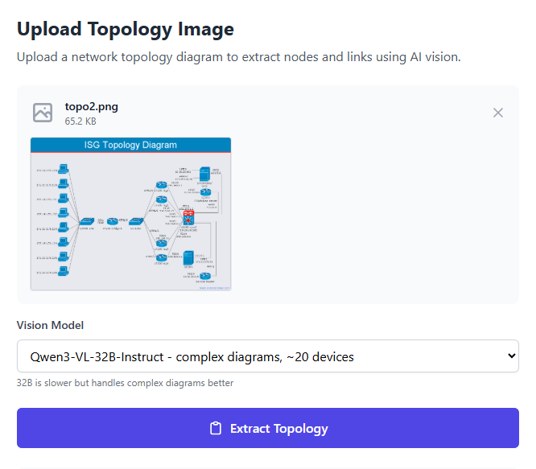
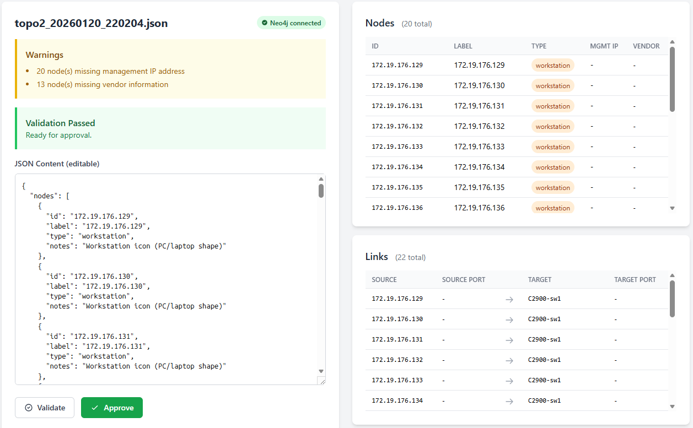
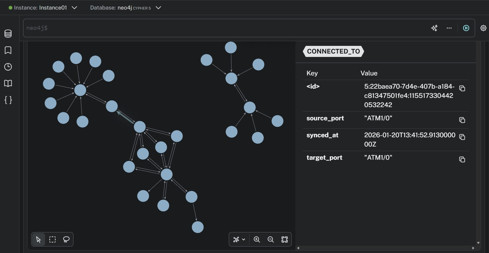

# Topo2Graph

**Convert network‑topology image into a structured representation for Neo4j graph construction, using computer vision and intelligent validation.**

<a name="demo"></a>
🚀 **[Live Demo](https://topo2graph.fly.dev/)**  
Graph visualization is not included within demo; it is handled separately via [Neo4j AuraDB](https://neo4j.com/product/auradb/).

[](https://www.python.org/)
[](https://fastapi.tiangolo.com/)
[](https://neo4j.com/)
[](https://fly.io/)

---

## Overview

Topo2Graph is a system/tool to aid in the digitization of network infrastructure diagrams into structured, queryable graph databases.  
The system combines AI vision models with human-in-the-loop validation to extract network topology data, validate relationships, and sync to Neo4j for advanced querying and impact analysis.

### Key Features

- **AI Vision Extraction**: Automatic topology extraction from network diagrams using [Qwen3-VL-8B](https://huggingface.co/Qwen/Qwen3-VL-8B-Instruct) or 32B vision model
- **Human-in-the-Loop Validation**: Web-based review interface for validating and editing extracted data
- **Graph Database Sync**: Automated Neo4j integration with relationship mapping
- **Real-time Validation**: Pydantic-based schema validation with comprehensive error detection
- **Production Deployment**: Deployed on Fly.io with persistent storage

---

## Screenshots

### Upload Interface

*Upload network diagrams for automatic AI extraction*

### Review and Edit

*Side-by-side validation with editable JSON and structured tables*

### Graph Database Visualization (not shown in [demo](#demo))

*Synced topology in Neo4j with queryable relationships and properties*

---

## Tech Stack

**Backend & Core**
- Python 3.9+ with Pydantic for data validation
- FastAPI + [Jinja2](https://www.packetcoders.io/an-introduction-to-jinja2-for-network-automation/) templating engine
- Neo4j AuraDB for graph database storage

**AI & Vision**
- Hugging Face Inference API
- Qwen/Qwen3-VL-8B-or 32B Instruct vision model
- Custom prompt engineering for topology extraction

**Frontend**
- Tailwind CSS for responsive UI
- Vanilla JavaScript for interactivity

**DevOps**
- Deployed on Fly.io
- Environment-based configuration
- File-drop architecture for async processing

---

## Architecture Highlights

### Vision Model Pipeline
- Processes network diagram images through vision AI
- Extracts nodes (devices) and links (connections) with ports
- Validates output against Pydantic schema

### Human-in-the-Loop Workflow
1. Upload topology diagram image
2. AI extracts structured JSON
3. Human reviews/edits in web UI
4. Validation engine checks for errors
5. Approved data syncs to Neo4j

### Graph Database Model
- **Nodes**: Network devices (routers, switches, servers, etc.)
- **Relationships**: `CONNECTED_TO` with port metadata
- **Bidirectional links** for network equipment
- **Intelligent port handling** based on device types

---

## Quick Start

```bash
# Clone and setup
git clone <repo-url>
cd topo2graph_v0
python -m venv .venv
source .venv/bin/activate
pip install -r requirements.txt

# Configure environment
cp .env.example .env
# Add HF_TOKEN and Neo4j credentials

# Run web interface
uvicorn topo2graph.web:app --reload
```

Visit `http://127.0.0.1:8000/` to access the Web UI.

---

## Example Usage

### Web UI Workflow
1. Navigate to `/upload`
2. Upload network diagram
3. Review extracted topology
4. Edit if needed and validate
5. Approve to sync to Neo4j

---

## Neo4j Graph Queries ( at Neo4j AuraDB )

**Find all connections for a device:**
```cypher
MATCH (n:Device {label: 'Switch1'})-[r]-(m) RETURN n, r, m
```

**Impact analysis (downstream devices):**
```cypher
MATCH (n:Device {label: 'Core-Router'})-[*]->(m) RETURN m
```

**View port mappings:**
```cypher
MATCH (a:Device)-[r:CONNECTED_TO]->(b:Device)
RETURN a.label AS source, r.source_port, r.target_port, b.label AS target
```

---

## Project Structure

```
topo2graph_v0/
├── topo2graph/              # Core Python package
│   ├── cli.py               # Command-line interface
│   ├── schema.py            # Pydantic models
│   ├── validation.py        # Validation logic
│   ├── vision.py            # Vision model integration
│   ├── web.py               # FastAPI application
│   └── graph.py             # Neo4j sync module
├── templates/               # Jinja2 UI templates
├── scripts/                 # Standalone utilities
├── inbox/                   # File-drop workflow directories
├── processed/
└── approved/
```

---

## Technical Achievements

- **AI Integration**: Successfully integrated Hugging Face vision models for domain-specific extraction
- **Data Validation**: Comprehensive Pydantic schema with blocking errors and non-blocking warnings
- **Graph Database**: Implemented intelligent bidirectional relationship mapping for network equipment
- **Production Ready**: Deployed with environment-based config and persistent storage
- **Human-in-the-Loop**: Built intuitive web UI for validation workflows

---

## Demo

**Live Application**: [https://topo2graph.fly.dev/](https://topo2graph.fly.dev/)

Try uploading a network diagram or review sample topologies in the inbox.
